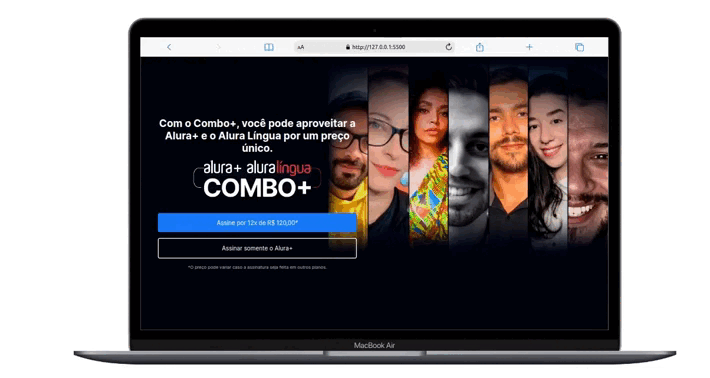

# Alura Plus

Desenvolvimento de uma aplicação frontend para o Alura Plus com HTML/CSS. A principal ideia é realizar uma lading-page para o alura plus.



## Funcionalidades

- Sessão para realizar uma compra direta do produto que está sendo oferecido, Alura Plus.
- Sessão para apresentar os meios que o comprador poderá utilizar o produto.
- Ambiente explicando um pouco sobre o produto que está sendo oferecido de forma simples.
- Ambiente para baixar os cursos, caso ele queira utilizar fora de um ambiente sem internet.
- Os dispositivos que ele poderia utilizar os produtos.
- Rodapé.

## Como utilizar

```bash
# Terminal

git clone https://github.com/MateusMaciel340/alura-plus.git # clone do repositório

cd alura-plus/ # acessando pasta

# acessar Live Server com index.html
```

## Contribuição

Contribuições são bem-vindas! Se você quiser contribuir com este projeto, por favor, abra uma issue para discutir suas ideias ou envie um pull request com suas alterações.

**Desenvolvedor:** Mateus Maciel - @mateusdev340

## Tecnologias:

- HTML
- CSS

## Licença

Este projeto é licenciado sob a licença Alura Cursos.